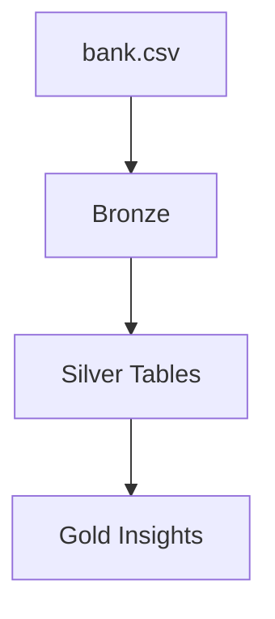

# Banking Transactions Lakehouse (Selected Dataset Edition)

## Business Problem & Solution

In many banking systems, data is stored in different places like transactions, customers, and accounts.  
This makes it difficult to analyze data and understand insights such as customer behavior or money flow.

To solve this, we built a data pipeline using lakehouse architecture.  
Data is first stored in the Bronze layer, then cleaned and structured in the Silver layer, and finally converted into insights in the Gold layer.  
This helps in faster analysis and better decision-making.

---

This repository implements a **Bronze → Silver → Gold** lakehouse for banking transaction data using **Databricks, PySpark, and Delta Lake**.

Repository: [Siddhardha2330/Banking-Transactions-Lakehouse-Project-Selected-Dataset-Edition](https://github.com/Siddhardha2330/Banking-Transactions-Lakehouse-Project-Selected-Dataset-Edition)

## Architecture

- **Bronze** — Stores raw CSV data  
- **Silver** — Cleans and transforms data into structured tables  
- **Gold** — Generates insights and reporting tables  

## Storage Layout

| Layer | Path | Purpose |
|------|------|--------|
| Bronze | `.../delta/bronze/transactions` | Raw data |
| Silver | `.../delta/silver/...` | Cleaned tables |
| Gold | `.../delta/gold/...` | Insights |

## Key Tables

### Silver Tables
- transactions  
- accounts  
- customers  
- branches  
- cards  

### Gold Tables
- Aggregated and reporting tables used for dashboards  

## Relationships

- One account → many transactions  
- One customer → one account  
- One account → many cards  
- One account → one branch  

## Repository Structure

| Path | Description |
|------|-------------|
| `notebooks/bronze/` | Load raw data |
| `notebooks/silver/` | Transform data |
| `notebooks/gold/` | Create insights |
| `sql/` | Queries for analysis |
| `screenshots/` | Output visuals |
